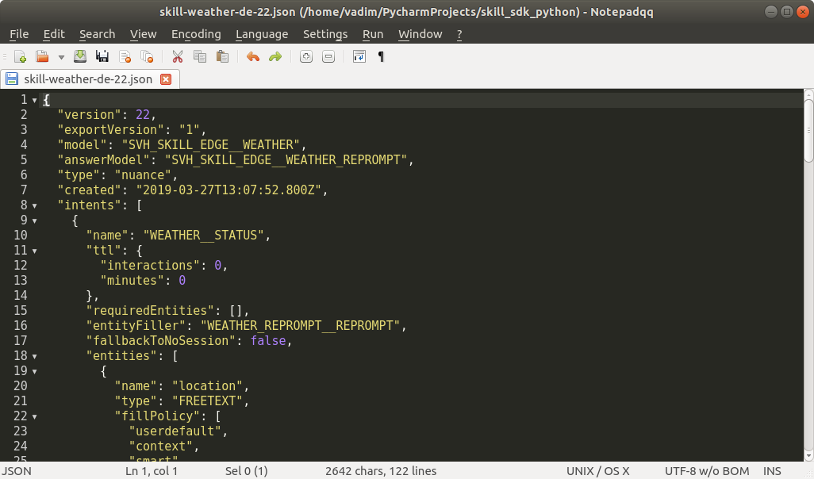
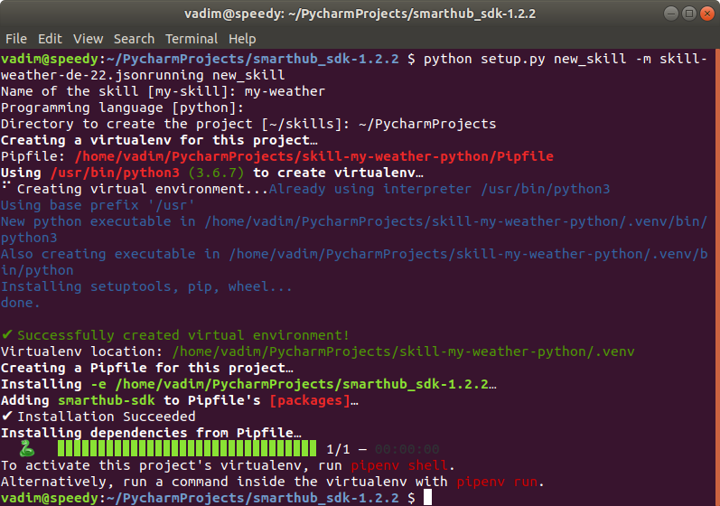
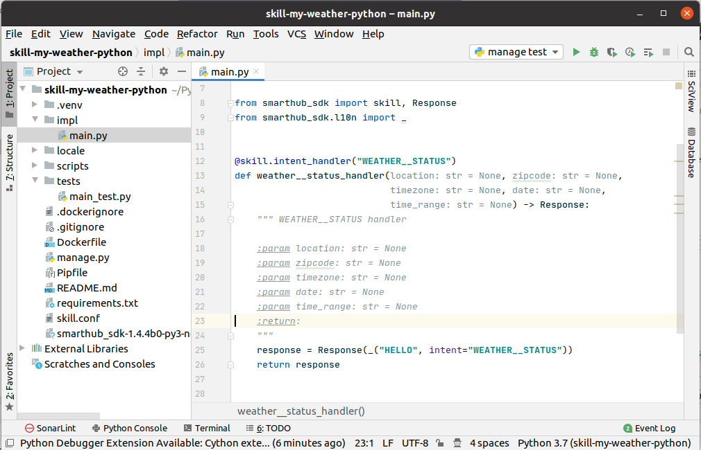

# Part 2: Weather Skill

We’ve done our homework and know exactly what’s going on inside a skill,
how to receive intent attributes, create responses and how to write unit
tests. Let’s get hacking and create some useful skill like weather
forecast.

First thing to do is to find a reliable weather API. We’ll go for
[OpenWeatherMap](https://openweathermap.org/). They have a free plan for
60 requests per minute and that is fine for educational purposes.

There are two major endpoints available for free accounts:

> Current weather data: [api.openweathermap.org/data/2.5/](https://api.openweathermap.org/data/2.5/weather?q=Köln)[weather?q=Köln](https://api.openweathermap.org/data/2.5/weather?q=Köln)

> 5 days forecast:
[api.openweathermap.org/data/2.5/forecast?q=Köln](https://api.openweathermap.org/data/2.5/forecast?q=Köln)

They are also able to run geo-location queries on ZIP code, using United
States zip codes if no country provided. So if we stick to Germany, “de”
should be added to the ZIP code query:

>A sample for 60306, current weather data:
[api.openweathermap.org/data/2.5/weather?](https://api.openweathermap.org/data/2.5/weather?zip=60306,de)[zip=60306,de](https://api.openweathermap.org/data/2.5/weather?zip=60306,de)

One more value that has to be supplied with any request is the API key
provided in `appid` GET parameter. We can get an API key upon sign-in to
[OpenWeatherMap](https://openweathermap.org/) in “API keys” tab.

>The complete request for “Köln”, current weather data would be
[api.openweathermap.org/data/2.5/weather?q=Köln,appid=xxxxxxxxxxxxxxxx](https://api.openweathermap.org/data/2.5/weather?q=Köln,appid=xxxxxxxxxxxxxxxx)

## Natural Language Model for WEATHER domain

The next big question is “How do I know if user asks for a weather
forecast?!” And that’s a good question. In SmartVoice Hub environment
user intents are predefined within machine learning models and the
models are grouped into domains.

If you’re creating a general purpose
skill, there is a high probability that the skill domain and user
intents are already defined. This is exactly the case with weather
skill. Language models for domain **WEATHER** are already in place and
you can receive them as JSON file that may look like this:



After a closer look you can see that the whole **WEATHER** domain consists
of a single intent “**WEATHER\_\_STATUS**” with the whole bunch of
parameters: `location`, `zipcode`, `timezone`, `date` and `time_range`.

You may guess that `location`, `zipcode` and `timezone` are
corresponding to location, zip code and time zone where the user’s
speaker is installed. While `date` and `time_range` sound like timing
parameters for the weather forecast. And you’ll be absolutely correct!
That’s exactly a set of parameters enough to get a current weather
situation in a particular place and produce a weather forecast.

## Creating Skill Skeleton
Next question is “What do I do with that JSON data? Can I use it to
create a skill?”

And the answer is “Yes!” The skill generator can accept the domain
metadata file and create a skill skeleton for the intents and entities
defined in it.

Let’s use that **new\_skill** command but with `-m` parameter:

> python setup.py new_skill -m skill-weather-de-22.json



In that example I named the skill “**my-weather**” and asked to place
the project again into my **\~/PycharmProjects** folder. Let’s open the
project in PyCharm!



What we see is horrifying! It’s just like few lines of generated code
but argument hinting suggests that all parameters can be empty. So we’ll
have to start off with planning the use cases and error handling first.

Let’s ignore the time zone at the beginning. We have enough parameters
to take care about. Once our weather skill gets successful, we can
extend it to other time zones.

We have two parameters for location: **`location`** and **`zipcode`**. What would that mean? The **`zipcode`** is a zip code of the region where
the speaker device is installed. So obviously **`location`** can be
anything the user asks for. Like if I’m going to Honolulu and would like
to know if I need to take a winter jacket.

So the logic is: If **`location`** is set, we get the weather for
**`location`**. If **`location`** is empty, we get the weather for
**`zipcode`**. If both are empty? We either ask the user to setup the device
location by providing zip code or ask them where they want to get
weather for. Well, let’s do both!

Other two parameters position us on the time axis: If **`date`** is
specified, we get the forecast for the date (let's also consider that if
the user asks for a forecast in 100 years, we might get quite a wrong one).

The **`time_range`** is quite complicated too: It can be “next three hours”
or “tomorrow afternoon” or “next three days” (and “next 100 years” too,
so we’ll have to consider that as well). But in SmartVoice Hub
environment those get converted to absolute date/time value pairs
separated by slash. For example, if it’s 18<sup>th</sup>
June 2019 now, “tomorrow afternoon” will be “2019-06-19T12:00:00/2019-06-19T18:00:00”.

At the end, if **`time_range`** is there but **`date`** is not, send a
forecast for the range. If both **`date`** and **`time_range`**
are supplied as parameters, we’ll ignore the **`date`** and send a forecast
for the range. What if neither **`date`** nor **`time_range`**
is supplied? I might guess, current weather situation is quite ok.

Let’s not forget that our forecast range is limited by current weather
and 5 days forecast. So if any of our date/time parameter is outside
this range, we’ll give a gentle warning to the user.

We have assembled enough info to start hacking. We’re all TDD remember?
Let’s please the Testing Goat!

## Worshiping the Testing Goat

Let’s edit **tests/main\_test.py** and put all our requirements there:

```python
import unittest
from impl.main import skill


class TestMain(unittest.TestCase):

    def test_weather__status_handler(self):
        """ Test weather__status_handler
        """

        # no intent entities provided
        response = skill.test_intent("WEATHER__STATUS")
        self.assertEqual(response.text.key, "MISSING_LOCATION")

        # zip code provided
        response = skill.test_intent("WEATHER__STATUS", zipcode='60306')
        self.assertEqual(response.text.key, "CURRENT_WEATHER")
        self.assertEqual(response.text.kwargs, {'location': 'Frankfurt am Main'})

        # zip code AND location
        response = skill.test_intent("WEATHER__STATUS", zipcode='60306', location='Darmstadt')
        self.assertEqual(response.text.key, "CURRENT_WEATHER")
        self.assertEqual(response.text.kwargs, {'location': 'Darmstadt'})

        # zip code, location AND date
        response = skill.test_intent("WEATHER__STATUS", zipcode='60306', location='Darmstadt', date='2019-06-18')
        self.assertEqual(response.text.key, "WEATHER_FORECAST")
        self.assertEqual(response.text.kwargs, {'location': 'Darmstadt', 'date': '2019-06-18'})

        # zip code, location, date AND time_range
        response = skill.test_intent("WEATHER__STATUS", zipcode='60306', location='Darmstadt', date='2019-06-18', 
                                     time_range='2019-06-18/2019-06-20')
        self.assertEqual(response.text.key, "WEATHER_FORECAST")
        self.assertEqual(response.text.kwargs, {'location': 'Darmstadt', 'date': '2019-06-18'})

        # if date or time_range outside our forecast range
        response = skill.test_intent("WEATHER__STATUS", zipcode='60306', location='Honolulu', date='2001-06-18', 
                                     time_range='2100-06-18/2119-06-20')
        self.assertEqual(response.text.key, "DATE_OUT_OF_FORECAST_RANGE")
```

You’ve got the idea? We are creating a test context object with
different parameters, calling `main.weather__status_handler` and
checking the returned `response.text`.

## Let’s Get Hacking!

There is a configuration file in the root of our project named
**skill.conf**. When the skill is deployed, the configuration values are automatically read from the
file. We put our configuration for
OpenWeatherMap API there:

```ini
[OpenWeatherMap]
url = https://api.openweathermap.org/data/2.5/
appid = <Your API key here>
```

These values are accessible from global **config** object - a wrapper on
top of Python’s
[ConfigParser](https://docs.python.org/3/library/configparser.html).

Now we create **impl/openweathermap.py** file with our OpenWeatherMap API:

```python
#
#   OpenWeatherMap API
#

from skill_sdk.config import config
import requests

appid = config.get('OpenWeatherMap', 'appid')
base_url = config.get('OpenWeatherMap', 'url')


def get_params(zipcode: str, location: str = None) -> dict:
    params = {'appid': appid}
    params.update({'q': 'location'} if location else {'zip': f'{zipcode},de'})
    return params


def get_current_weather(zipcode: str, location: str = None) -> dict:
    url = base_url + 'weather'
    response = requests.get(url, params=get_params(zipcode, location))
    return response.json()


def get_weather_forecast(zipcode: str, location: str = None) -> dict:
    url = base_url + 'forecast'
    response = requests.get(url, params=get_params(zipcode, location))
    return response.json()
```

We have defined two functions that access the API for the current
weather and the forecast and one helper function `get_params` that
creates a dictionary with parameters to access the API.

Now let’s get to **impl/main.py**:

```python
#!/usr/bin/env python

""" Minimal implementation of the intent "WEATHER__STATUS"
    
"""
import arrow
import datetime
from dateutil.parser import parse
from skill_sdk import skill, Response, l10n, _
from . import openweathermap


def date_in_range(date: datetime.date) -> bool:
    today = datetime.datetime.now().date()
    return today <= date <= today + datetime.timedelta(days=5)


def current_weather(zipcode: str, location: str = None) -> l10n.Message:
    pass


def forecast_for_date(date: datetime.date, zipcode: str, location: str = None) -> l10n.Message:
    pass


def forecast_for_range(time_start: datetime.datetime, time_end: datetime.datetime,
                       zipcode: str, location: str = None) -> l10n.Message:
    pass


@skill.intent_handler("WEATHER__STATUS")
def weather__status_handler(location: str = None, zipcode: str = None, timezone: str = None,
                            date: datetime.date = None, time_range: str = None) -> Response:
    """ WEATHER__STATUS handler
        
    :param location: str = None
    :param zipcode: str = None
    :param timezone: str = None
    :param date: str = None
    :param time_range: str = None
    :return:
    """
    if not location and not zipcode:
        return Response(_("MISSING_LOCATION"))

    if time_range:
        time_start, time_end = [parse(v) for v in time_range.split('/')]
        if not date_in_range(time_start.date()) or not date_in_range(time_end.date()):
            return Response(_("DATE_OUT_OF_FORECAST_RANGE"))
        return Response(forecast_for_range(time_start, time_end, zipcode, location))

    if date:
        if not date_in_range(date):
            return Response(_("DATE_OUT_OF_FORECAST_RANGE"))
        return Response(forecast_for_date(date, zipcode, location))

    return Response(current_weather(zipcode, location))


if __name__ == '__main__':  # pragma: no cover
    skill.run()
```

We split the OpenWeatherMap API calls into three functions:

- `current_weather` would return a current weather in requested location,
- `forecast_for_date` gives us the weather forecast for the particular date,
- `forecast_for_range` provides a list of forecasts within a range.

In our implementation, `weather__status_handler` actually performs
the parameters checking, routing the calls to corresponding API function
and building a final `Response` object.

We should now implement the API wrappers that will take a dictionary
from OpenWeatherMap and construct a well-sound message.

The function `current_weather` is the simplest: Our goal is to produce a message
like `It is <weather condition> in <location> with <temperature>. 
Temperature range is between <temperature low> and <temperature high>`:

```python
def current_weather(zipcode: str, location: str = None) -> l10n.Message:
    current = openweathermap.get_current_weather(zipcode, location)
    # It's clear sky in Frankfurt am Main with 28°. Temperature range is between 25° and 30°
    message = _('CURRENT_WEATHER').format(location=current['name'],
                                          condition=current['weather'][0]['description'],
                                          temp=current['main']['temp'],
                                          temp_min=current['main']['temp_min'],
                                          temp_max=current['main']['temp_max'])
    return message
```

All necessary fields are available in the current weather API response. We simply have to format the message. The message itself is defined in
**locale/en.po**:

```
msgid "CURRENT_WEATHER"
msgstr "It's {condition} in {location} with {temp} degrees centigrade."
"Temperature range is between {temp_min} and {temp_max} degrees."
```

The forecast data is more complicated: It consists of 3-hour interval
series. The weather condition can vary from interval to interval so as
their lows and highs. Let’s suppose for simplicity reasons that our
potential listener would be most interested in the morning and afternoon
conditions and split the forecast into two, producing a message like 
`In the morning on <date> in <location> is expected <morning conditions> 
with temperature range from <morning low> to <morning high>.  
In the afternoon - <afternoon conditions> with temperature range from 
<afternoon  low> to <afternoon high>`:

```python
def forecast_for_date(date: datetime.date, zipcode: str, location: str = None) -> l10n.Message:
    forecast = openweathermap.get_weather_forecast(zipcode, location)

    # We'll split the intervals to morning (06:00 - 12:00) and afternoon (12:00 - 21:00) conditions
    morning = [interval for interval in forecast['list']
               if arrow.get(date).replace(hour=6) <= arrow.get(interval['dt']) <= arrow.get(date).replace(hour=12)]

    afternoon = [interval for interval in forecast['list']
                 if arrow.get(date).replace(hour=12) < arrow.get(interval['dt']) <= arrow.get(date).replace(hour=21)]

    morning_condition = _('THEN').join(set([sample['weather'][0]['description'] for sample in morning]))
    morning_temp_min = min([sample['main']['temp_min'] for sample in morning])
    morning_temp_max = max([sample['main']['temp_max'] for sample in morning])

    afternoon_condition = _('THEN').join(set([sample['weather'][0]['description'] for sample in afternoon]))
    afternoon_temp_min = min([sample['main']['temp_min'] for sample in afternoon])
    afternoon_temp_max = max([sample['main']['temp_max'] for sample in afternoon])

    message = _('WEATHER_FORECAST').format(location=forecast['city']['name'], date=date.isoformat(),
                                           morning_condition=morning_condition,
                                           morning_temp_min=morning_temp_min,
                                           morning_temp_max=morning_temp_max,
                                           afternoon_condition=afternoon_condition,
                                           afternoon_temp_min=afternoon_temp_min,
                                           afternoon_temp_max=afternoon_temp_max)
    return message
```

We are splitting the intervals into two groups: The morning intervals
from 06:00 up to 12:00 and the afternoon intervals up to 18:00. Then,
we’re joining the weather conditions and get the min and max values for
the temperature. What’s left is to define the messages in
**locale/en.po**:

```
msgid "THEN"
msgstr " followed by "

msgid "WEATHER_FORECAST"
msgstr "In the morning on {date} in {location} is expected {morning_condition} with temperature range from "
"{morning_temp_min} to {morning_temp_max} degrees centigrade. "
"In the afternoon - {afternoon_condition} with temperature range from {afternoon_temp_min} to {afternoon_temp_max}"
```

Technically speaking we could take the same approach when creating a
forecast for a range of days, but we’re not looking for easy ways, are
we? Suppose, when asking for several days forecast, our listener is more
interested in what are the expected conditions in the morning, at
mid-day and later in the evening. The resulting message should be more
like `Here is <number of days> days weather forecast for <location>: 
In the morning on <date> <morning condition> is expected followed by <noon condition> at midday, 
<evening condition> is expected in the evening. 
Daily temperature ranges from <temperature low> to <temperature high>`:

```python
def forecast_for_range(time_start: datetime.datetime, time_end: datetime.datetime,
                       zipcode: str, location: str = None) -> l10n.Message:
    forecast = openweathermap.get_weather_forecast(zipcode, location)

    def get_daily_forecast(date: arrow.Arrow) -> l10n.Message:
        # We'll sample the condition in the morning (06:00), at noon (12:00) and at the evening (18:00)
        condition_0600 = [sample['weather'][0]['description'] for sample in forecast['list']
                          if arrow.get(date).replace(hour=6) == arrow.get(sample['dt'])]
        condition_1200 = [sample['weather'][0]['description'] for sample in forecast['list']
                          if arrow.get(date).replace(hour=12) == arrow.get(sample['dt'])]
        condition_1800 = [sample['weather'][0]['description'] for sample in forecast['list']
                          if arrow.get(date).replace(hour=18) == arrow.get(sample['dt'])]
        temp_min = min([sample['main']['temp_min'] for sample in forecast['list']])
        temp_max = max([sample['main']['temp_max'] for sample in forecast['list']])
        return _('WEATHER_FORECAST_SAMPLED').format(date=date.date().isoformat(),
                                                    morning_condition=condition_0600,
                                                    noon_condition=condition_1200,
                                                    evening_condition=condition_1800,
                                                    temp_min=temp_min,
                                                    temp_max=temp_max)

    messages = [get_daily_forecast(date) for date in arrow.Arrow.range('day', time_start, time_end)]
    message = _('WEATHER_FORECAST_RANGE').format(location=forecast['city']['name'],
                                                 days=(time_end - time_start).days,
                                                 time_start=time_start.date().isoformat(),
                                                 time_end=time_end.date().isoformat(),
                                                 message=''.join(messages))
    return message
```

And the messages in **locale/en.po**:

```
msgid "WEATHER_FORECAST_SAMPLED"
msgstr "In the morning on {date} {morning_condition} is expected followed by {noon_condition} at midday, "
"{evening_condition} is expected in the evening. Daily temperature ranges from {temp_min} to {temp_max}. "

msgid "WEATHER_FORECAST_RANGE"
msgstr "Here is {days} days weather forecast for {location}: {message}"
```

## Mocking and Patching the Testing Goat

Let’s hit **Alt-Shift-F10** and **manage test** from our run configuration.
FAIL! 

> AssertionError: 'DATE\_OUT\_OF\_FORECAST\_RANGE' != 'WEATHER\_FORECAST'

We certainly must have done something horribly wrong… Yes, we hard-coded
the dates into the unit tests, and what was valid yesterday is no
longer. Like “2019-06-18” would be a valid date for forecast yesterday,
today it is a past date that is out of range.

We could have changed the
dates in the unit tests and allow it to run successfully, but it will
fail tomorrow again. Additionally, they would request the data from
OpenWeatherMap every time we run it.

Let’s properly patch our Testing Goat with mocks and other things. We’ll
download the JSON data from
<https://api.openweathermap.org/data/2.5/weather?q=Frankfurt%20am%20Main&appid=appid=xxxxxxxxxxxxxxxx&units=metric>
and save it as **tests/weather.json**.

The forecast data from
<https://api.openweathermap.org/data/2.5/forecast?q=Darmstadt&appid=xxxxxxxxxxxxxxxxxxxxxx&units=metric>
we’ll save as **tests/forecast.json**.

And let’s rewrite our unit tests with mocked results using `requests_mock` module:

```python
import json
import unittest
from skill_sdk.test_helpers import create_context
from pathlib import Path
from impl.main import skill
import requests_mock


def get_json_response(filename: str):
    with open(Path(__file__).parent / filename) as data:
        return json.load(data)


class TestMain(unittest.TestCase):
    @requests_mock.mock()
    def test_weather__status_parameters(self, rq):
        """ Test weather__status_handler
        """
        rq.get('https://api.openweathermap.org/data/2.5/weather', json=get_json_response('weather.json'))
        rq.get('https://api.openweathermap.org/data/2.5/forecast', json=get_json_response('forecast.json'))
        # no intent entities provided
        response = skill.test_intent("WEATHER__STATUS")
        self.assertEqual(response.text.key, "MISSING_LOCATION")
        # zip code provided
        response = skill.test_intent("WEATHER__STATUS", zipcode='60306')
        self.assertEqual(response.text.key, "CURRENT_WEATHER")
        self.assertEqual(response.text.kwargs['location'], 'Frankfurt am Main')
        # zip code AND location
        response = skill.test_intent("WEATHER__STATUS", zipcode='60306', location='Darmstadt')
        self.assertEqual(response.text.key, "CURRENT_WEATHER")
        self.assertEqual(response.text.kwargs['location'], 'Frankfurt am Main')
        # zip code, location AND date
        response = skill.test_intent("WEATHER__STATUS", zipcode='60306', location='Darmstadt', date='2019-06-20')
        self.assertEqual(response.text.key, "WEATHER_FORECAST")
        self.assertEqual(response.text.kwargs['location'], 'Darmstadt')
        self.assertEqual(response.text.kwargs['date'], '2019-06-20')
        # zip code, location, date AND time_range
        response = skill.test_intent("WEATHER__STATUS", zipcode='60306', location='Darmstadt', date='2019-06-20', 
                                     time_range='2019-06-20/2019-06-22')
        self.assertEqual(response.text.key, "WEATHER_FORECAST_RANGE")
        self.assertEqual(response.text.kwargs['location'], 'Darmstadt')
        self.assertEqual(response.text.kwargs['time_start'], '2019-06-20')
        self.assertEqual(response.text.kwargs['time_end'], '2019-06-22')
        # if date or time_range outside our forecast range
        response = skill.test_intent("WEATHER__STATUS", zipcode='60306', location='Honolulu', date='2001-06-18', 
                                     time_range='2100-06-18/2100-06-20')
        self.assertEqual(response.text.key, "DATE_OUT_OF_FORECAST_RANGE")
```

Now that thing really works and covers 98% of source code lines.

## Homework: Increase Coverage!